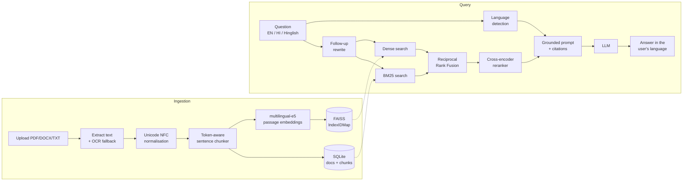

# BhashaRAG: bilingual (Hindi + English) RAG over your own documents

Upload PDFs, Word files or text notes in **Hindi, English or both**. Then ask questions in
**English, हिंदी or Hinglish** and get answers grounded in your documents, with page-level
citations. You can add or remove documents at any time, and the knowledge base updates immediately.

Most RAG demos assume English. BhashaRAG is built around what breaks for Indian languages:
tokenizer inefficiency on Devanagari, cross-lingual retrieval (a Hindi question about an English PDF),
romanised Hinglish queries, and scanned or legacy-font Hindi PDFs. It also includes a measurable
research track: a tokenizer study, embedding fine-tuning and a retrieval ablation benchmark.

---

## Features

| | |
|---|---|
| **Live knowledge base** | Upload (multi-file, drag and drop) or delete documents from the UI or API. Vectors, BM25 and metadata stay in sync. Duplicate uploads are detected by content hash. |
| **Hindi + English + Hinglish** | Multilingual embeddings place Hindi and English in one vector space. The answer language follows the question's language and script. |
| **Hybrid retrieval** | Dense (multilingual-E5) + BM25 with a Devanagari-aware tokenizer, merged with Reciprocal Rank Fusion. |
| **Cross-encoder reranking** | A multilingual MiniLM cross-encoder re-scores the top candidates. |
| **Token-aware chunking** | Chunks are sized with the embedding model's own tokenizer and split on sentence boundaries, including the Hindi danda (।). |
| **Grounded answers + citations** | Every claim cites `[n]`. Click a citation to see the exact passage, file and page. |
| **Conversational** | Follow-ups ("what about its eligibility?") are rewritten into standalone search queries. |
| **Scoped search** | Tick documents to restrict answers to them. |
| **Pluggable LLM** | Claude (Anthropic API), a local Ollama model, any OpenAI-compatible API (e.g. Groq's free tier), or none. |
| **Robust ingestion** | PDF, DOCX, TXT, MD. Optional OCR (Tesseract `hin+eng`) for scanned pages, plus a warning for legacy Kruti Dev-style fonts. |
| **Research track** | Tokenizer fertility study plus a custom SentencePiece tokenizer, synthetic bilingual Q&A generation, contrastive fine-tuning with hard negatives, and Recall/MRR/nDCG ablations. |

## Architecture



**Why each piece exists**

- **NFC normalisation.** The same Hindi syllable can be encoded as different code-point sequences (e.g. `क़` as U+0958 or as `क` + nukta). Without normalisation, BM25 and tokenizer statistics silently break.
- **Token-aware chunking.** Multilingual tokenizers spend 2–4× more tokens per word on Devanagari than on English. A "1000-character" Hindi chunk can exceed the embedder's 512-token window and get truncated without any error.
- **Hybrid retrieval.** Embeddings capture meaning across languages. BM25 catches exact names, numbers and section IDs that embeddings blur. RRF merges the two without needing their scores to be comparable.
- **Reranker.** Bi-encoders embed the query and passage separately. A cross-encoder reads them together, which is much more precise, but too slow for the whole corpus, so it runs only on the top ~25 candidates.
- **Chunk ids as FAISS ids** (`IndexIDMap2`, SQLite `AUTOINCREMENT`). Deleting a document removes exactly its vectors, and ids are never reused, so a stale vector can never point at the wrong text.
- **Self-healing index.** On startup the FAISS index is checked against SQLite. If it is missing, stale or was built with a different embedding model, all chunks are re-embedded automatically.

## Quickstart (Windows / macOS / Linux)

```bash
python -m venv .venv
.venv\Scripts\activate            # macOS/Linux: source .venv/bin/activate
pip install -r requirements.txt
copy .env.example .env            # macOS/Linux: cp .env.example .env

python -m uvicorn bhasharag.api:app --port 8000
```

Open http://localhost:8000. On first start, the embedding model (~470 MB) and reranker (~470 MB) download from Hugging Face.

With the default `LLM_PROVIDER=none` the app already works: it retrieves and shows the most relevant passages.
To get written answers, pick an LLM in `.env`:

| Option | Cost | Setup |
|---|---|---|
| **Ollama** (local) | Free, offline | Install [Ollama](https://ollama.com), run `ollama pull qwen2.5:3b`, then set `LLM_PROVIDER=ollama` |
| **Groq** (OpenAI-compatible) | Free tier | Create a key at console.groq.com, then set `LLM_PROVIDER=openai_compatible` and `OPENAI_API_KEY=...` |
| **Claude** | Paid API | Set `LLM_PROVIDER=anthropic` and `ANTHROPIC_API_KEY=...` (model: `claude-opus-5`) |

Run the tests with `python -m pytest`. They use a fake embedder, so no model download is needed.

## REST API

Interactive docs are at http://localhost:8000/docs.

| Method | Path | Purpose |
|---|---|---|
| `GET` | `/api/documents` | List documents |
| `POST` | `/api/documents` | Upload one or more files (`multipart/form-data`, field `files`) |
| `DELETE` | `/api/documents/{id}` | Remove a document and its vectors |
| `GET` | `/api/documents/{id}/chunks` | Inspect how a document was chunked |
| `POST` | `/api/search` | Retrieval only: `{"query": "...", "top_k": 5}` |
| `POST` | `/api/chat` | `{"question": "...", "history": [...], "doc_ids": [...]}` returns the answer, sources and timings |
| `GET` | `/api/health` | Model names and document/chunk counts |

```bash
curl -F "files=@scheme.pdf" -F "files=@notes_hindi.docx" http://localhost:8000/api/documents
curl -X POST http://localhost:8000/api/chat -H "Content-Type: application/json" \
     -d "{\"question\": \"इस योजना के लिए कौन पात्र है?\"}"
```

## Research track: turn the project into measurable results

These scripts produce the numbers for your README and resume. Run them after uploading a
reasonably sized corpus (e.g. 20–50 documents, mixed Hindi and English).

```bash
pip install -r requirements-research.txt

# 1. Tokenizer study: how much more does Hindi cost per word, per tokenizer?
python -m research.tokenizer_study

# 2. Build a bilingual benchmark (EN / HI / Hinglish questions per chunk, split by chunk)
python -m research.generate_synthetic_qa --n-chunks 300

# 3. Baseline ablation: BM25 vs dense vs hybrid vs hybrid + rerank
python -m research.evaluate_retrieval --tag baseline

# 4. Fine-tune the embedder (MultipleNegativesRankingLoss + mined hard negatives)
python -m research.finetune_embeddings --epochs 2

# 5. Re-evaluate with the fine-tuned model
python -m research.evaluate_retrieval --embedding-model models/bhasha-e5-finetuned --tag finetuned
```

Results are written to `research/results/` as Markdown tables and JSON. To serve the fine-tuned
model, set `EMBEDDING_MODEL=models/bhasha-e5-finetuned` in `.env` and restart. The index re-embeds itself.

> **Rigour tip:** hand-check ~50 generated test questions and remove bad ones. The benchmark is split
> *by chunk*, so fine-tuning never sees a test passage. Mention both in interviews.

## Project structure

```
bhasharag/
  api.py              FastAPI app: REST endpoints + serves the UI
  knowledge_base.py   add/delete documents, hybrid search, grounded answering
  loaders.py          PDF / DOCX / TXT / MD extraction, OCR fallback, legacy-font check
  text_utils.py       NFC normalisation, language detection, Devanagari-aware tokenisation
  chunker.py          sentence-preserving, token-budgeted chunking with overlap
  embedder.py         multilingual sentence embeddings (E5 query/passage prefixes)
  vector_store.py     FAISS index keyed by chunk id (supports deletes)
  retrieval.py        BM25, reciprocal rank fusion, cross-encoder reranker
  llm.py              Claude / Ollama / OpenAI-compatible backends
  prompts.py          grounded bilingual prompt templates
  db.py               SQLite metadata
static/               web UI (vanilla HTML/CSS/JS)
research/             tokenizer study, Q&A generation, fine-tuning, evaluation
tests/                pytest suite (no model downloads)
```

## Known limitations (good interview talking points)

- Language detection is a script-ratio heuristic. It is fast and has no model to download, but it can mislabel very short Hinglish queries.
- BM25 does no Hindi stemming, so `किसान` and `किसानों` are different terms. Dense retrieval covers most of this gap.
- DOCX files have no fixed pages, so citations point to "page 1".
- Exact (flat) FAISS search is fine up to roughly a few hundred thousand chunks. Beyond that, switch to HNSW or IVF.

See [docs/ROADMAP.md](docs/ROADMAP.md) for the phase-by-phase plan and stretch goals.
